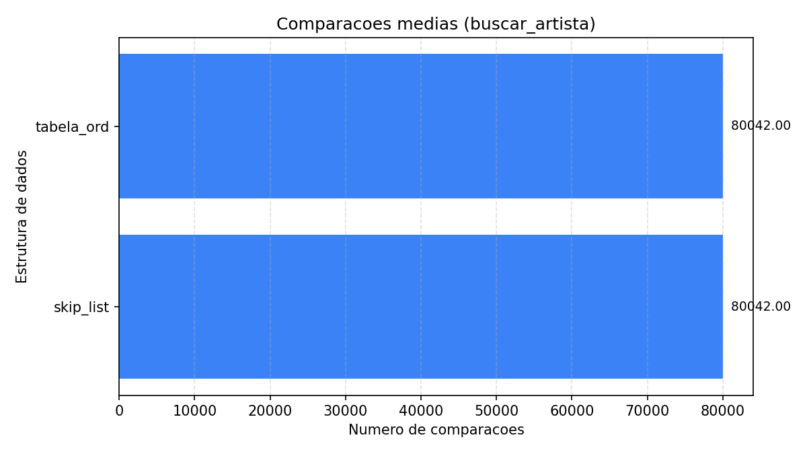
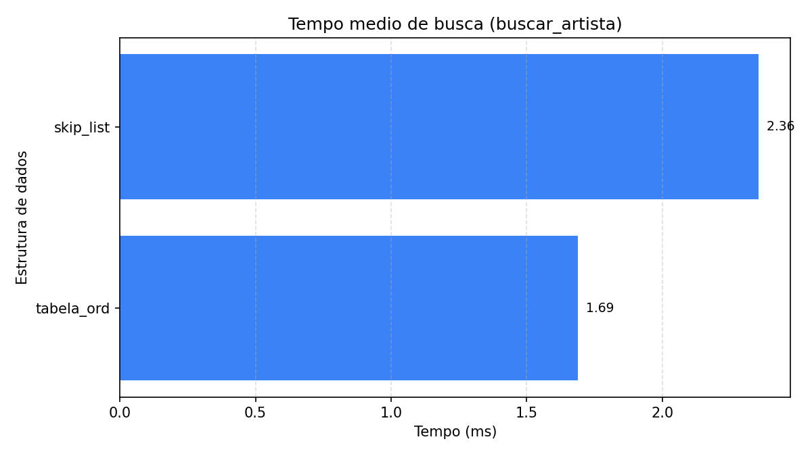
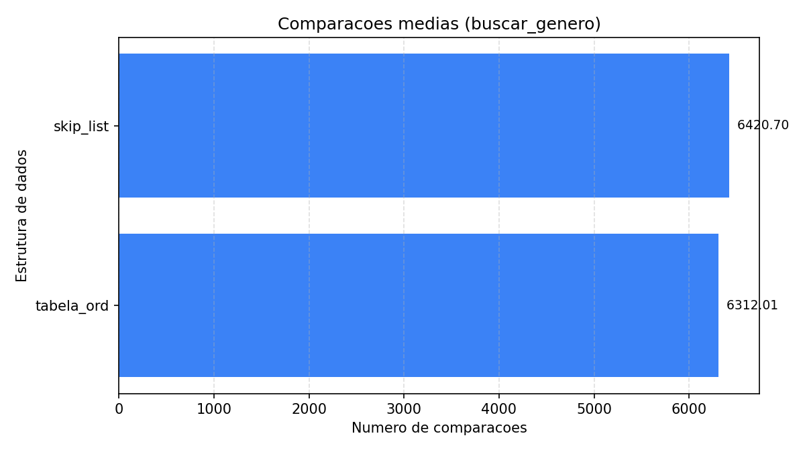
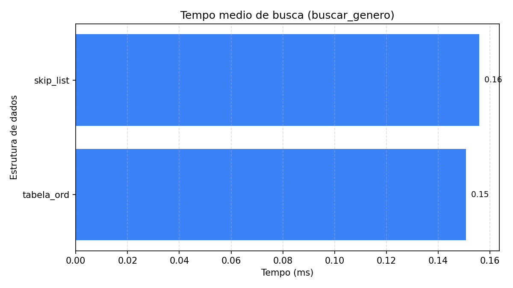
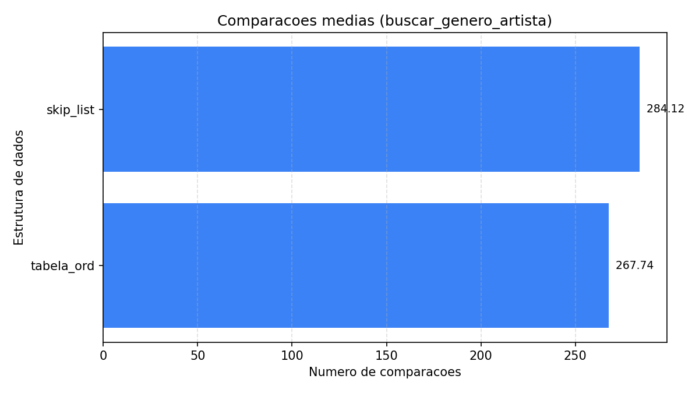
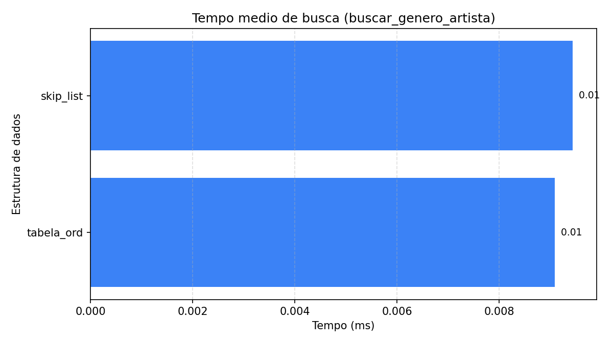

# WikiArt Search

Sistema de busca sobre metadados do [WikiArt](https://www.wikiart.org/) com engine em C, benchmark comparativo de duas estruturas de dados e interface web.

Desenvolvido para a disciplina de Estruturas de Dados. Corpus de aproximadamente 80.000 obras, 1.119 artistas e 27 estilos.

## Arquitetura

```
Navegador (HTML + CSS + JS)  ->  Servidor HTTP em C  ->  Engine de busca em C
```

A engine em C11 puro implementa os TADs `Obra`, `Resultado`, `Csv` e `Buscador`, além das duas estruturas de busca comparadas.

## Estruturas de dados

As duas estruturas indexam pela mesma chave composta **(gênero, artista)**:
gênero primário, artista secundário. `k` é o número de obras do bloco alcançado.

| Estrutura | Como aplica a chave | Busca por artista | Busca por gênero | Gênero + artista | Inserção |
|---|---|---|---|---|---|
| SkipList (probabilística) | nível 0 ordenado pela chave composta | O(n) | O(log n + k) esperado | O(log n + k) esperado | O(log n) esperado |
| TabelaOrd (lista indexada) | array ordenado pela chave composta | O(n) | O(log n + k) | O(log n + k) | O(n) |

Ambas mantêm a mesma ordem total sobre a chave composta; o que muda é como
chegam ao bloco procurado. A **TabelaOrd** guarda tudo num array ordenado e
faz busca binária de verdade, porque tem acesso aleatório. A **SkipList**
ordena o nível 0 e desce pelos níveis sorteados, o que dá o mesmo custo em
esperança, não garantido — em troca, insere sem deslocar nada.

O efeito é comum às duas: gênero e o par gênero+artista ficam rápidos, e a
busca só por artista degenera em varredura completa, porque as obras de um
mesmo artista ficam espalhadas entre os blocos de gênero.

Cada estrutura implementa a interface `Buscador`, uma vtable que permite plugar novas EDs no benchmark com uma linha de código.

## Resultados

Benchmark sobre 80.042 obras, com 10.000 buscas por operação. Dados brutos em
`assets/bench_80k.csv`.

| Estrutura | Operação | Tempo médio (ms) | Comparações médias |
|---|---|---|---|
| skip_list | buscar_artista | 2.3558 | 80042.00 |
| skip_list | buscar_genero | 0.1558 | 6420.70 |
| skip_list | buscar_genero_artista | 0.0094 | 284.12 |
| tabela_ord | buscar_artista | **1.6900** | 80042.00 |
| tabela_ord | buscar_genero | **0.1506** | **6312.01** |
| tabela_ord | buscar_genero_artista | **0.0091** | **267.74** |

Custo de carga das 80.042 obras:

| Estrutura | Inserção (ms) |
|---|---|
| tabela_ord | 138.29 |
| skip_list | **55.05** |

### Busca por artista, número médio de comparações



### Busca por artista, tempo médio



### Busca por gênero, número médio de comparações



### Busca por gênero, tempo médio



### Busca por gênero e artista, número médio de comparações



### Busca por gênero e artista, tempo médio



**Busca por gênero.** As duas empatam em torno de 6.300 comparações, e não é
coincidência: esse é o tamanho médio do bloco de um gênero, ponderado pela
chance de cada gênero ser sorteado. Chegar ao bloco é barato nas duas, seja por
busca binária ou descida de níveis. O que sobra é copiar o resultado, e isso
nenhuma das duas evita.

**Busca por gênero e artista.** A consulta que a chave composta foi desenhada
para servir, e a mais rápida das duas estruturas: TabelaOrd em 268 comparações
e SkipList em 284, contra as ~6.300 do gênero inteiro. Ambas localizam o bloco
do par exato e só percorrem ele, então o corte de uma ordem de grandeza vem da
chave, não da estrutura. Os 6% que separam as duas são o preço de a SkipList
ser sorteada: os níveis aproximam a busca binária em esperança, não a
reproduzem.

**Busca por artista.** Degenera nas duas, como esperado de uma chave
secundária: sem o gênero não há por onde entrar no índice, e as obras de um
mesmo artista estão espalhadas por todos os blocos. Ambas pagam as 80.042
comparações cheias. O que difere é só o relógio — 1,69 ms da TabelaOrd contra
2,36 ms da SkipList, 28% a menos para a mesma varredura. É localidade de
memória: um array contíguo percorre mais rápido que nós encadeados espalhados
pelo heap.

**Inserção.** Aqui a ordem se inverte. A SkipList carrega as 80.042 obras em 55
ms contra 138 ms da TabelaOrd, 2,5x mais rápida, e é a diferença entre O(log n)
esperado e O(n): inserir no meio de um array ordenado obriga a deslocar toda a
cauda, enquanto a SkipList só religa ponteiros. É a contrapartida direta do
acesso aleatório que faz a TabelaOrd ganhar nas buscas.

**O balanço.** A chave composta acertou o alvo: `buscar_genero_artista`, a
consulta que a interface realmente faz na navegação estilo → artista → obras,
é a operação mais rápida das duas estruturas. O custo foi empurrado para a
busca só por artista, que nenhuma tela usa. Entre as duas, a escolha é o
clássico troca-carga-por-consulta: a SkipList constrói o índice 2,5x mais
rápido, a TabelaOrd responde mais rápido em todas as três buscas. Como este
índice é montado uma vez na subida do servidor e consultado a cada navegação, a
TabelaOrd é o padrão da interface.

## Estrutura de pastas

```
wikiart_search/
├── assets/                     # CSVs e graficos do benchmark
├── engine/                     # Engine em C
│   ├── data/
│   ├── include/
│   ├── src/
│   ├── test/
│   └── Makefile
├── scripts/                    # Scripts Python auxiliares
├── web/                        # Interface web
└── README.md
```

## Como usar

### 1. Preparar os dados

Baixe o `classes.csv` do dataset [steubk/wikiart](https://www.kaggle.com/datasets/steubk/wikiart) e coloque na raiz do projeto. Depois:

```bash
uv sync
uv run python scripts/preparar_dados.py
```

Isso gera `engine/data/metadados.csv` no formato esperado pela engine.

### 2. Compilar e testar

```bash
cd engine
make
make test
```

A suíte tem 58 testes. Para checar vazamentos:

```bash
make test-valgrind
```

### 3. Rodar o benchmark

```bash
./wikiart_server data/metadados.csv --bench 10000 > ../assets/bench_80k.csv
cd ..

uv run python scripts/plotar_benchmark.py assets/bench_80k.csv
```

Gera os seis gráficos em `assets/graficos/`, dois por operação medida.

### 4. Modo de listagem

```bash
cd engine
./wikiart_server data/metadados_fake.csv        # lista 5 obras
./wikiart_server data/metadados_fake.csv 20     # lista 20 obras
```

### 5. Interface web

A navegação é em três níveis: **estilo → artista → obras**.

```bash
uv run python scripts/gerar_indice.py   # gera web/indice.json a partir do metadados.csv
docker compose up -d                    # sobe engine (8080) e interface (3000)
```

Abra <http://localhost:3000>.

As listas de estilos e de artistas por estilo saem do `web/indice.json`, um
arquivo estático de ~86 KB gerado do próprio `metadados.csv`. A engine só
responde obras, então montar essas listas pela API custaria baixar o gênero
inteiro (13 mil obras no Impressionismo) apenas para extrair nomes. Regenere o
índice sempre que o `metadados.csv` mudar.

A busca do terceiro nível vai em `/api/busca?genero=&artista=&ed=` e exibe as
métricas que a engine devolve — estrutura, algoritmo, tempo e número de
comparações. O seletor no topo troca a estrutura e refaz a mesma consulta, o
que permite comparar as duas lado a lado pela interface.

As imagens vêm direto do endpoint de arquivo único do Kaggle, que é aberto para
este dataset (CC0) e não exige token:

```
https://www.kaggle.com/api/v1/datasets/download/steubk/wikiart/<caminho>
```

Para apontar a interface para uma engine em outra porta, use
`http://localhost:3000/?api=http://localhost:9090` — a escolha fica salva no
navegador.

## Autores

- Miguel Mochizuki Silva
- Arthur Gomes
- Leudo Neto

## Licença

Código-fonte sob licença [MIT](LICENSE).

Os dados são provenientes do WikiArt e do dataset público [steubk/wikiart](https://www.kaggle.com/datasets/steubk/wikiart), destinados apenas a pesquisa não-comercial, conforme os termos do [WikiArt.org](https://www.wikiart.org/).
