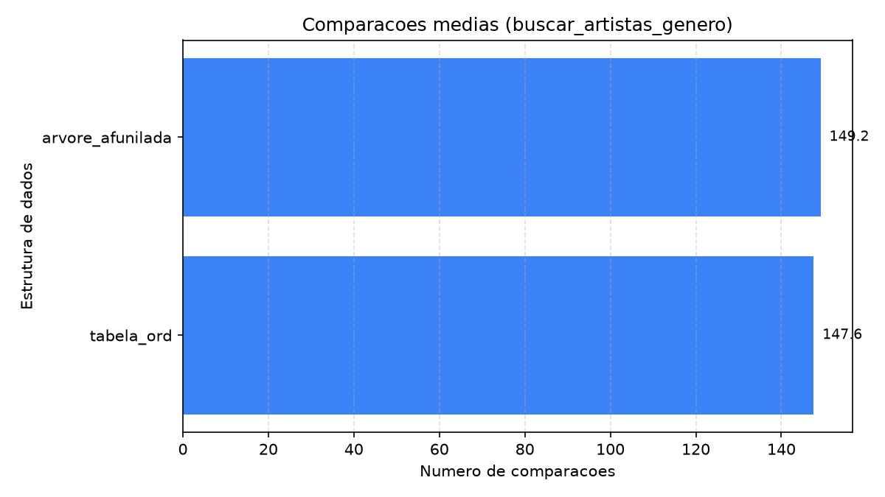
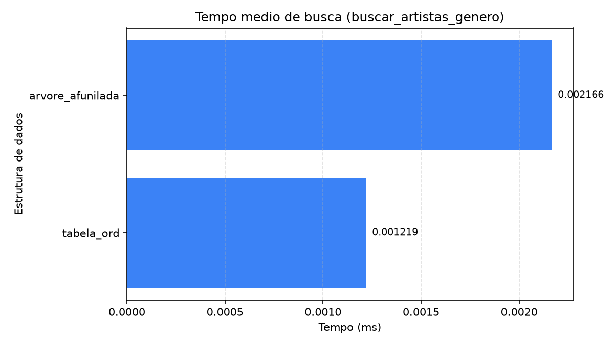
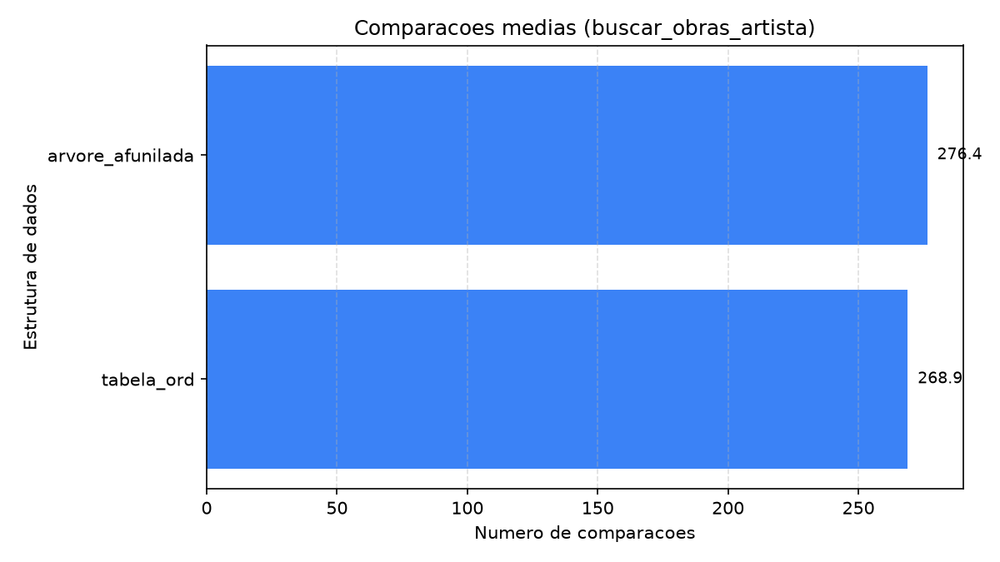
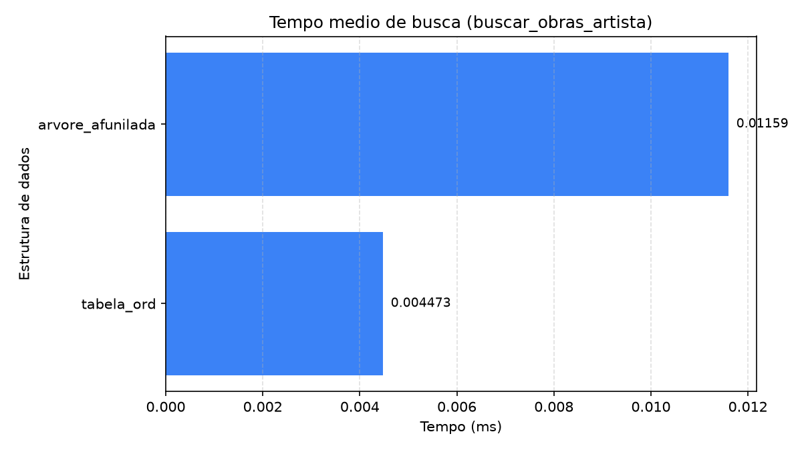
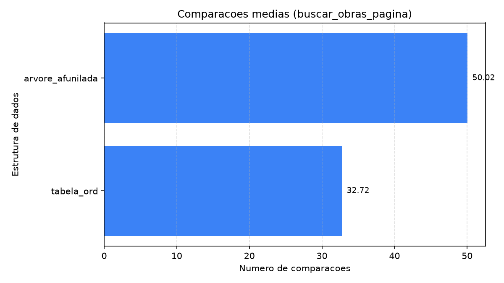
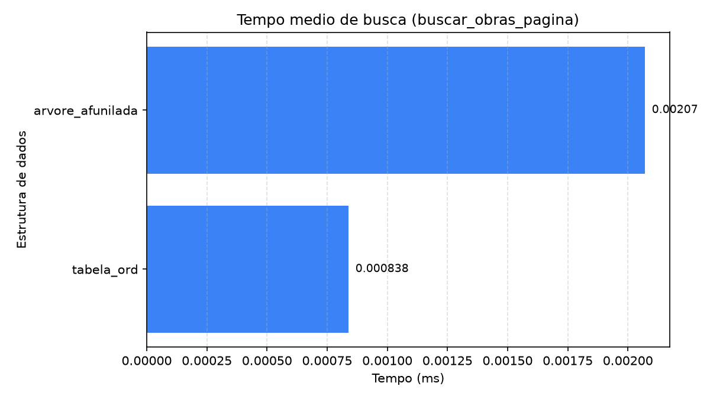

# WikiArt Search

Sistema de busca e navegação sobre os metadados do [WikiArt](https://www.wikiart.org/): uma engine em C11 que indexa 80.042 obras em duas estruturas de dados, um servidor HTTP e uma interface web que mostra a estrutura trabalhando.

Trabalho de Estruturas de Dados e Algoritmos II. Acervo de 80.042 obras, 1.119 artistas e 27 estilos, navegado em três níveis: **estilo → artista → obras**.

## Visão geral

```
Navegador (HTML + CSS + JS)  ->  Servidor HTTP em C  ->  Engine de busca em C
```

- **Duas estruturas de dados**, uma linear e uma hierárquica: uma lista indexada ordenada (`TabelaOrd`, busca binária) e uma árvore afunilada (`ArvoreAfunilada`, splay tree).
- **Uma interface comum** (`Buscador`, uma vtable) que liga as duas ao servidor e ao benchmark. Uma nova estrutura entra no sistema com uma linha de código.
- **Modificações nos algoritmos clássicos**, pensadas para a aplicação, descritas e medidas abaixo.
- **Benchmark** das duas estruturas sobre o acervo completo e **interface web** com uma tela para cada estrutura.

## Estruturas de dados

Cada estrutura mantém três instâncias, uma por nível da navegação. Ambas são genéricas: recebem na criação a ordem entre itens e, a cada busca, um comparador que recorta um intervalo contíguo dessa ordem.

| Nível | Itens | Chave de ordenação | Busca da navegação |
|---|---|---|---|
| 1. Gêneros | 27 estilos, com contagens e capa | nome | todos (listagem) ou um gênero |
| 2. Artistas | 2.082 pares (gênero, artista), com contagem e capa | (gênero, artista) | os artistas de um gênero |
| 3. Obras | 80.042 obras | (gênero, artista, id) | as obras de um artista num gênero |

No nível 2, quem pintou em mais de um gênero aparece uma vez em cada, com a contagem daquele gênero. Ordenar pelo gênero primeiro deixa os artistas de um gênero contíguos, e é isso que permite buscá-los pela chave parcial. No nível 3 o id desempata as obras de um mesmo par e deixa cada chave única, o que a árvore precisa para levar uma obra específica ao topo.

Os itens dos dois primeiros níveis saem do `Catalogo`, que a engine monta do próprio CSV na subida. Cada gênero e cada artista leva uma **obra de capa**: a do artista é a primeira obra dele no gênero, e a do gênero é a capa do seu artista mais prolífico (Pollock no Action Painting, Picasso no Cubismo Analítico).

| Estrutura | Busca de um intervalo | Página de `limite` itens | Inserção | Forma |
|---|---|---|---|---|
| TabelaOrd (lista indexada) | O(log n + k) | O(log n + limite) | O(n) | array contíguo |
| ArvoreAfunilada (splay tree) | O(log n + k) amortizado | O(log n + limite) amortizado | O(log n) amortizado | nós com filhos, pai e tamanho da subárvore |

`k` é o número de itens do intervalo encontrado.

### TabelaOrd

Array ordenado. A busca é uma busca binária de limite inferior até o começo do intervalo, seguida da coleta enquanto o comparador der zero. Inserir no meio obriga a deslocar a cauda.

### ArvoreAfunilada

Árvore binária de busca sem balanceamento explícito. Todo acesso leva o nó acessado até a raiz por rotações, dois níveis por passo: zig-zig quando nó, pai e avô estão alinhados, zig-zag quando fazem cotovelo, e zig quando só falta o pai. O que foi usado há pouco fica perto do topo, e o custo amortizado de cada operação é O(log n), mas uma operação isolada pode custar O(n), e até as buscas alteram a estrutura.

## Modificações nos algoritmos clássicos

Os algoritmos clássicos buscam uma chave exata. A aplicação precisa de blocos inteiros (todos os artistas de um estilo, todas as obras de um artista), em páginas, e sem que a árvore vire uma lista. As modificações:

| Modificação | Em | O que muda em relação ao clássico |
|---|---|---|
| Busca de intervalo por chave parcial | as duas | O comparador devolve <0, 0 ou >0 contra uma chave parcial, e um bloco inteiro sai numa busca. Na tabela, a busca binária vira limite inferior e não para no primeiro casamento. Na árvore, a descida para no primeiro nó de dentro (o mais alto do intervalo), que sobe à raiz; o intervalo fica abaixo dela e a coleta anda de sucessor em sucessor. |
| Tamanho da subárvore em cada nó | árvore | As rotações mantêm `tam = 1 + tam(esq) + tam(dir)` nos dois nós que mudam de lugar, e a inserção o incrementa no caminho. Com ele, o total do intervalo e a posição do primeiro item de uma página saem em O(altura), sem percorrer o intervalo. |
| Busca paginada `buscar_pagina(offset, limite)` | as duas | Devolve só uma fatia do intervalo. Na tabela, dois limites por busca binária dão o começo e o fim do intervalo. Na árvore, os tamanhos dão o nó de partida por seleção, e a coleta anda só `limite` sucessores, sem chamar o comparador por item. |
| Afunilamento ascendente sem recursão | árvore | Ponteiros para o pai permitem afunilar, percorrer em ordem e liberar sem pilha, porque a árvore pode ficar tão funda quanto uma lista. |
| Ordem de carga embaralhada | as duas | O CSV vem agrupado por artista e com ids crescentes. Carregado assim, cada bloco (gênero, artista) entraria em ordem crescente, e a árvore, que leva cada nó novo à raiz, viraria uma lista encadeada pela esquerda. A ordem é embaralhada com semente fixa, e as duas estruturas recebem a mesma. |
| Vista restrita ao intervalo | árvore | Recorta os quatro primeiros níveis da árvore mostrando só os nós do intervalo, mantendo a hierarquia real entre eles, com o número de descendentes de cada nó calculado pelos tamanhos. |

## Resultados

Benchmark sobre 80.042 obras, com 10.000 buscas por operação. Cada busca sorteia uma obra e usa a chave dela até o nível medido, então gêneros e artistas pesam na proporção do acervo, como numa navegação real. As duas estruturas respondem à mesma sequência de consultas. Dados brutos em [`assets/bench_80k.csv`](assets/bench_80k.csv).

| Estrutura | Operação | Tempo médio (µs) | Comparações médias | Rotações médias |
|---|---|---|---|---|
| tabela_ord | buscar_genero | **0,09** | **6,88** | 0 |
| tabela_ord | buscar_artistas_genero | **1,22** | **147,55** | 0 |
| tabela_ord | buscar_obras_artista | **4,47** | **268,91** | 0 |
| tabela_ord | buscar_obras_pagina | **0,84** | **32,72** | 0 |
| arvore_afunilada | buscar_genero | 0,15 | 7,77 | 3,24 |
| arvore_afunilada | buscar_artistas_genero | 2,17 | 149,16 | 3,25 |
| arvore_afunilada | buscar_obras_artista | 11,60 | 276,37 | 10,71 |
| arvore_afunilada | buscar_obras_pagina | 2,07 | 50,02 | 10,55 |

`buscar_obras_pagina` é a busca das obras de um artista pedindo só a primeira página de 30 obras, que é o que a interface faz.

Custo de carga dos três níveis (27 + 2.082 + 80.042 itens):

| Estrutura | Inserção (ms) |
|---|---|
| tabela_ord | 324,16 |
| arvore_afunilada | **111,21** |

| Comparações médias | Tempo médio |
|---|---|
|  |  |
|  |  |
|  |  |
|  |  |

Uma linha por operação: gênero, artistas do gênero, obras do artista e primeira página de obras.

### Análise

**Busca de um gênero.** A tabela faz 6,88 comparações: busca binária sobre 27 itens (log₂ 27 ≈ 4,75) mais as duas da coleta. A árvore faz 7,77, e as 3,24 rotações dizem a profundidade média em que o gênero estava. Uma árvore perfeitamente balanceada de 27 nós tem profundidade média 3,04, e a afunilada chega perto disso sem balancear nada, porque as consultas são enviesadas: 38% delas caem em Impressionism, Realism e Romanticism, e a entropia da distribuição é 4,07 bits, contra os 4,75 de uma uniforme. O que é muito pedido fica perto do topo.

**Busca dos artistas de um gênero.** 147,55 contra 149,16 comparações, quase tudo coleta: o gênero sorteado tem em média 135 artistas, e as duas pagam uma comparação por artista coletado. Chegar ao bloco custa cerca de 11 comparações na tabela e 13 na árvore.

**Busca das obras de um artista.** As comparações quase empatam (268,91 contra 276,37), porque o bloco médio tem 251 obras e a coleta domina nas duas. O relógio não empata: 4,47 µs da tabela contra 11,60 µs da árvore, 2,6x. É localidade de memória. A tabela percorre um array contíguo, e a árvore salta entre 80 mil nós espalhados pelo heap, andando de sucessor em sucessor pelos ponteiros, e ainda faz 10,71 rotações por busca.

**Busca paginada.** Pedir só 30 obras em vez das 251 do bloco médio elimina a coleta que pesa. Na árvore, o tempo cai de 11,60 para 2,07 µs (5,6x) e as comparações de 276 para 50. Na tabela, de 4,47 para 0,84 µs (5,3x) e de 269 para 33. A árvore continua 2,5x mais lenta que a tabela, porque a localidade de memória não muda. O preço é um `int` a mais por nó (de 32 para 40 bytes com o alinhamento).

**Inserção.** Aqui a ordem se inverte. A árvore carrega os três níveis em 111 ms contra 324 ms da tabela, 2,9x mais rápida, e é a diferença entre O(log n) amortizado e O(n): com a carga embaralhada, cada inserção no meio do array desloca em média metade da cauda, enquanto a árvore só desce e religa ponteiros.

**O balanço.** A tabela responde mais rápido nos três níveis, e a árvore constrói o índice 2,9x mais rápido e se adapta ao uso, o que a tabela não faz. Como o índice é montado uma vez na subida do servidor e consultado a cada navegação, a tabela é o padrão da interface. A árvore entra como a vista que mostra a estrutura trabalhando.

## Interface web

A navegação é em três níveis: **estilo → artista → obras**. O seletor no topo troca a estrutura e refaz a consulta da tela aberta, e toda tela mostra as métricas da busca (estrutura, algoritmo, tempo, comparações e rotações).

- **Tabela ordenada:** cada tela é uma grade, com estilos e artistas mostrados pela pintura de capa. As obras têm rolagem infinita, que pede à engine uma página de 30 por vez.
- **Árvore afunilada:** a tela desenha a vista dos quatro primeiros níveis da árvore (1 + 2 + 4 + 8 nós). A raiz ocupa a primeira fileira inteira, e cada nó divide a largura do pai com o irmão. Clicar num nó o afunila até a raiz, e a engine devolve a árvore já reorganizada. Clicar na raiz abre o próximo nível ou, nas obras, amplia a pintura. Nos níveis 2 e 3 a vista mostra só o intervalo da tela, e um selo `+N` na última fileira diz quantos itens ficaram abaixo.

As árvores guardam o estado entre requisições, e esse estado é do servidor, não do navegador: todos os clientes veem a mesma árvore, com o último acesso de qualquer um na raiz.

O tema é um claro-escuro de ateliê: fundo de noite, fios de ouro velho e numerais romanos marcando os três níveis. As fontes (Cinzel, Cormorant Garamond e Jost) vêm do Google Fonts, e sem rede a interface cai nas fontes do sistema. Quem usa `prefers-reduced-motion` não vê as animações.

### API

| Rota | Nível | Parâmetros |
|---|---|---|
| `GET /api/generos` | 1 | `ed`, `foco=<gênero>` |
| `GET /api/artistas` | 2 | `genero` (obrigatório), `ed`, `foco=<artista>` |
| `GET /api/busca` | 3 | `genero` (obrigatório), `artista`, `ed`, `foco=<id da obra>`, `offset` e `limite` |
| `GET /api/comparar` | 3 | `genero`, `artista`: a mesma busca nas duas estruturas |
| `GET /api/status` | | |

`ed` é `tabela_ord` (padrão) ou `arvore_afunilada`. Com `limite`, a resposta traz só a página, e `total_encontrados` é o tamanho do intervalo inteiro. `foco` acessa um item e, na árvore, o leva à raiz.

## Ferramentas

| Parte | Ferramentas |
|---|---|
| Engine e servidor | C11 (gcc, `-Wall -Wextra -Wpedantic`), Make, sockets POSIX |
| Testes | [µnit](https://nemequ.github.io/munit/) (incluído em `engine/test`), valgrind |
| Interface | HTML, CSS e JavaScript puros, sem build |
| Empacotamento | Docker e Docker Compose (engine em Debian slim, interface em nginx) |
| Dados e gráficos | Python 3.12, [uv](https://docs.astral.sh/uv/), pandas, matplotlib, ruff |

## Estrutura de pastas

```
.
├── assets/
│   ├── graficos/               # gráficos do benchmark (PNG)
│   └── bench_80k.csv           # saída do benchmark sobre o acervo completo
├── engine/                     # engine e servidor em C
│   ├── data/                   # metadados (o CSV completo é gerado, ver abaixo)
│   ├── include/                # protótipos dos TADs
│   ├── src/                    # implementação
│   ├── test/                   # suíte µnit
│   ├── Dockerfile
│   └── Makefile
├── scripts/                    # preparação dos dados e gráficos (Python)
├── web/                        # interface web estática
├── docker-compose.yml
├── pyproject.toml
└── README.md
```

## Como usar

### 1. Preparar os dados

Baixe o `classes.csv` do dataset [steubk/wikiart](https://www.kaggle.com/datasets/steubk/wikiart), coloque na raiz do projeto e rode:

```bash
uv sync
uv run python scripts/preparar_dados.py
```

Isso gera `engine/data/metadados.csv` no formato esperado pela engine.

### 2. Interface web

```bash
docker compose up -d --build            # sobe engine (8080) e interface (3000)
```

Abra <http://localhost:3000>. Por padrão a engine sobe com `engine/data/metadados_fake.csv`; para usar o acervo completo, defina `WIKIART_CSV=data/metadados.csv`. Para apontar a interface para uma engine em outra porta, use `http://localhost:3000/?api=http://localhost:9090`.

As imagens vêm do endpoint de arquivo único do Kaggle, aberto para este dataset (CC0) e sem token:

```
https://www.kaggle.com/api/v1/datasets/download/steubk/wikiart/<caminho>
```

### 3. Compilar e testar a engine

```bash
cd engine
make
make test              # 77 testes
make test-valgrind     # confere vazamentos
```

### 4. Benchmark

```bash
cd engine
./wikiart_server data/metadados.csv --bench 10000 > ../assets/bench_80k.csv
cd ..
uv run python scripts/plotar_benchmark.py assets/bench_80k.csv assets/graficos
```

### 5. Modo de listagem

```bash
cd engine
./wikiart_server data/metadados_fake.csv        # lista 5 obras
./wikiart_server data/metadados_fake.csv 20     # lista 20 obras
```

## Processo de desenvolvimento

O projeto foi planejado pelos autores: a escolha das duas estruturas, a navegação em três níveis, as modificações nos algoritmos e o desenho do benchmark saíram de discussões do grupo. A implementação em C das estruturas de dados (`TabelaOrd`, `ArvoreAfunilada` e o restante da engine) foi escrita e documentada manualmente pelos autores. Ferramentas de IA auxiliaram apenas na configuração do projeto Python, isto é, no `pyproject.toml` e no ambiente do `uv`.

## Autores

- Miguel Mochizuki Silva
- Arthur Gomes
- Leudo Neto

## Licença

Código-fonte sob licença [MIT](LICENSE).

Os dados são provenientes do WikiArt e do dataset público [steubk/wikiart](https://www.kaggle.com/datasets/steubk/wikiart), destinados apenas a pesquisa não-comercial, conforme os termos do [WikiArt.org](https://www.wikiart.org/).
