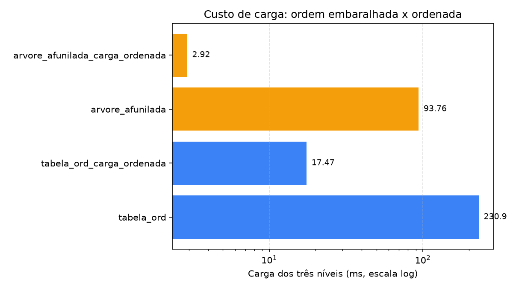
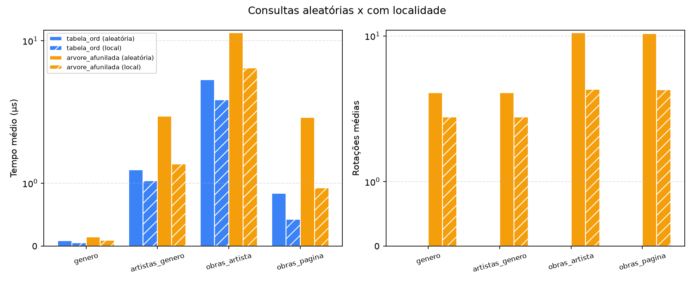

# WikiArt Search

Sistema de busca e navegação sobre os metadados do [WikiArt](https://www.wikiart.org/): uma engine em C11 que indexa 80.042 obras em duas estruturas de dados, um servidor HTTP e uma interface web que mostra a estrutura trabalhando.

Trabalho de Estruturas de Dados e Algoritmos II. Acervo de 80.042 obras, 1.119 artistas e 27 estilos, navegado em três níveis: **estilo → artista → obras**.

## Visão geral

```
Navegador (HTML + CSS + JS)  ->  Servidor HTTP em C  ->  Engine de busca em C
```

- **Duas estruturas de dados**, uma linear e uma hierárquica: uma lista indexada ordenada (`TabelaOrd`, busca binária) e uma árvore afunilada (`ArvoreAfunilada`, splay tree).
- **Uma interface comum** (`Buscador`, uma vtable) que liga as duas ao servidor e ao benchmark. Uma nova estrutura entra no sistema com uma linha de código.
- **Modificações nos algoritmos clássicos**, pensadas para a aplicação, descritas e medidas abaixo.
- **Benchmark** das duas estruturas sobre o acervo completo e **interface web** com uma tela para cada estrutura.

## Estruturas de dados

Cada estrutura mantém três instâncias, uma por nível da navegação. Ambas são genéricas: recebem na criação a ordem entre itens e, a cada busca, um comparador que recorta um intervalo contíguo dessa ordem.

| Nível | Itens | Chave de ordenação | Busca da navegação |
|---|---|---|---|
| 1. Gêneros | 27 estilos, com contagens e capa | nome | todos (listagem) ou um gênero |
| 2. Artistas | 2.082 pares (gênero, artista), com contagem e capa | (gênero, artista) | os artistas de um gênero |
| 3. Obras | 80.042 obras | (gênero, artista, id) | as obras de um artista num gênero |

No nível 2, quem pintou em mais de um gênero aparece uma vez em cada, com a contagem daquele gênero. Ordenar pelo gênero primeiro deixa os artistas de um gênero contíguos, e é isso que permite buscá-los pela chave parcial. No nível 3 o id desempata as obras de um mesmo par e deixa cada chave única, o que a árvore precisa para levar uma obra específica ao topo.

Os itens dos dois primeiros níveis saem do `Catalogo`, que a engine monta do próprio CSV na subida. Cada gênero e cada artista leva uma **obra de capa**: a do artista é a primeira obra dele no gênero, e a do gênero é a capa do seu artista mais prolífico (Pollock no Action Painting, Picasso no Cubismo Analítico).

| Estrutura | Busca de um intervalo | Página de `limite` itens | Inserção | Forma |
|---|---|---|---|---|
| TabelaOrd (lista indexada) | O(log n + k) | O(log n + limite) | O(n) | array contíguo |
| ArvoreAfunilada (splay tree) | O(log n + k) amortizado | O(log n + limite) amortizado | O(log n) amortizado | nós com filhos, pai e tamanho da subárvore |

`k` é o número de itens do intervalo encontrado.

### TabelaOrd

Array ordenado. A busca é uma busca binária de limite inferior até o começo do intervalo, seguida da coleta enquanto o comparador der zero. Inserir no meio obriga a deslocar a cauda.

### ArvoreAfunilada

Árvore binária de busca sem balanceamento explícito. Todo acesso leva o nó acessado até a raiz por rotações, dois níveis por passo: zig-zig quando nó, pai e avô estão alinhados, zig-zag quando fazem cotovelo, e zig quando só falta o pai. O que foi usado há pouco fica perto do topo, e o custo amortizado de cada operação é O(log n), mas uma operação isolada pode custar O(n), e até as buscas alteram a estrutura.

## Modificações nos algoritmos clássicos

Os algoritmos clássicos buscam uma chave exata. A aplicação precisa de blocos inteiros (todos os artistas de um estilo, todas as obras de um artista), em páginas, e sem que a árvore vire uma lista. As modificações:

| Modificação | Em | O que muda em relação ao clássico |
|---|---|---|
| Busca de intervalo por chave parcial | as duas | O comparador devolve <0, 0 ou >0 contra uma chave parcial, e um bloco inteiro sai numa busca. Na tabela, a busca binária vira limite inferior e não para no primeiro casamento. Na árvore, a descida para no primeiro nó de dentro (o mais alto do intervalo), que sobe à raiz; o intervalo fica abaixo dela e a coleta anda de sucessor em sucessor. |
| Tamanho da subárvore em cada nó | árvore | As rotações mantêm `tam = 1 + tam(esq) + tam(dir)` nos dois nós que mudam de lugar, e a inserção o incrementa no caminho. Com ele, o total do intervalo e a posição do primeiro item de uma página saem em O(altura), sem percorrer o intervalo. |
| Busca paginada `buscar_pagina(offset, limite)` | as duas | Devolve só uma fatia do intervalo. Na tabela, dois limites por busca binária dão o começo e o fim do intervalo. Na árvore, os tamanhos dão o nó de partida por seleção, e a coleta anda só `limite` sucessores, sem chamar o comparador por item. |
| Afunilamento ascendente sem recursão | árvore | Ponteiros para o pai permitem afunilar, percorrer em ordem e liberar sem pilha, porque a árvore pode ficar tão funda quanto uma lista. |
| Ordem de carga embaralhada | as duas | O CSV vem agrupado por artista e com ids crescentes. Carregado assim, cada bloco (gênero, artista) entraria em ordem crescente, e a árvore, que leva cada nó novo à raiz, viraria uma lista encadeada pela esquerda. A ordem é embaralhada com semente fixa, e as duas estruturas recebem a mesma. É uma troca, não um ganho de desempenho: ver "Carga embaralhada contra carga na ordem das chaves". |
| Vista restrita ao intervalo | árvore | Recorta os quatro primeiros níveis da árvore mostrando só os nós do intervalo, mantendo a hierarquia real entre eles, com o número de descendentes de cada nó calculado pelos tamanhos. |

## Resultados

Benchmark sobre 80.042 obras, com 10.000 buscas por operação, em três cenários:

- **Consultas aleatórias:** cada busca sorteia uma obra e usa a chave dela até o nível medido, então gêneros e artistas pesam na proporção do acervo, como numa navegação real.
- **Consultas com localidade** (sufixo `_local`): uma sessão de navegação que se demora em poucas obras. 8 obras ficam em foco, 90% das consultas caem nelas, e o foco muda a cada 250 consultas.
- **Carga clássica** (sufixo `_carga_ordenada`): a mesma estrutura carregada na ordem das chaves, sem o embaralhamento que o sistema usa.

Todas as estruturas respondem exatamente à mesma sequência de consultas. Dados brutos em [`assets/bench_80k.csv`](assets/bench_80k.csv).

### Consultas aleatórias

| Estrutura | Operação | Tempo médio (µs) | Comparações médias | Rotações médias |
|---|---|---|---|---|
| tabela_ord | buscar_genero | **0,09** | **6,88** | 0 |
| tabela_ord | buscar_artistas_genero | **1,21** | **147,44** | 0 |
| tabela_ord | buscar_obras_artista (todas as obras) | **4,53** | **270,00** | 0 |
| tabela_ord | buscar_obras_pagina (30 obras) | **0,84** | **32,72** | 0 |
| tabela_ord | buscar_obras_pagina_qualquer (30 obras, posição sorteada) | **0,94** | **32,72** | 0 |
| arvore_afunilada | buscar_genero | 0,15 | 7,77 | 3,24 |
| arvore_afunilada | buscar_artistas_genero | 2,17 | 149,44 | 3,25 |
| arvore_afunilada | buscar_obras_artista (todas as obras) | 11,81 | 277,40 | 10,68 |
| arvore_afunilada | buscar_obras_pagina (30 obras) | 2,12 | 50,32 | 10,50 |
| arvore_afunilada | buscar_obras_pagina_qualquer (30 obras, posição sorteada) | 2,77 | 50,46 | 10,54 |

| Comparações médias | Tempo médio |
|---|---|
|  |  |
|  |  |
|  |  |
|  |  |

Uma linha por operação: gênero, artistas do gênero, obras do artista e primeira página de obras.

**Busca de um gênero.** A tabela faz 6,88 comparações: busca binária sobre 27 itens (log₂ 27 ≈ 4,75) mais as duas da coleta. A árvore faz 7,77, e as 3,24 rotações dizem a profundidade média em que o gênero estava. Uma árvore perfeitamente balanceada de 27 nós tem profundidade média 3,04, e a afunilada chega perto disso sem balancear nada, porque as consultas são enviesadas: 38% delas caem em Impressionism, Realism e Romanticism, e a entropia da distribuição é 4,07 bits, contra os 4,75 de uma uniforme.

**Busca dos artistas de um gênero.** Quase tudo é coleta: o gênero sorteado tem em média 135 artistas, e as duas estruturas pagam uma comparação por artista coletado (147,44 contra 149,44).

**Busca das obras de um artista.** As comparações quase empatam (270,00 contra 277,40), porque o bloco médio tem 251 obras e a coleta domina nas duas. O relógio não empata: 4,53 µs da tabela contra 11,81 µs da árvore, 2,6x. É localidade de memória. A tabela percorre um array contíguo, e a árvore salta entre 80 mil nós espalhados pelo heap, andando de sucessor em sucessor, e ainda faz 10,68 rotações por busca.

### Comparação com o algoritmo clássico

Cada modificação foi medida contra o comportamento que o algoritmo clássico teria.

#### Busca paginada contra coletar o intervalo inteiro

O clássico devolve o intervalo todo (`buscar_obras_artista`, 251 obras em média); a versão modificada devolve só uma página. Pedir 30 obras faz a árvore cair de 11,81 para 2,12 µs (5,6x) e de 277 para 50 comparações, e a tabela de 4,53 para 0,84 µs (5,4x) e de 270 para 33. O ganho se mantém com a página em posição sorteada dentro do intervalo (`buscar_obras_pagina_qualquer`): 2,77 µs na árvore e 0,94 µs na tabela. Na árvore, isso só é possível porque cada nó guarda o tamanho da subárvore, o que dá o nó de partida da página por seleção em O(altura), sem percorrer os itens anteriores. O preço é um `int` a mais por nó (de 32 para 40 bytes com o alinhamento). A árvore continua 2,5x mais lenta que a tabela, porque a localidade de memória não muda.

#### Carga embaralhada contra carga na ordem das chaves

| Estrutura | Carga dos três níveis (ms) | Obras do artista: tempo (µs) | Rotações médias |
|---|---|---|---|
| tabela_ord, carga embaralhada | 230,94 | 4,53 | 0 |
| tabela_ord, carga ordenada | **17,47** | 4,74 | 0 |
| arvore_afunilada, carga embaralhada | 93,76 | 11,81 | 10,68 |
| arvore_afunilada, carga ordenada | **2,92** | **6,97** | 25,78 |



O resultado é menos favorável ao embaralhamento do que se esperava, e vale dizer com clareza:

- **A carga ordenada é muito mais barata nas duas estruturas** (32x na árvore, 13x na tabela). Na tabela, isso é o efeito descrito em aula: inserir sempre no fim não desloca nada, e o custo Θ(n²) só aparece quando a ordem de chegada é aleatória, que é o que o embaralhamento produz. A vantagem de 2,5x da árvore na inserção (94 ms contra 231 ms) existe só com a carga embaralhada; na ordenada, as duas cargam em milissegundos.
- **A carga ordenada deixa a árvore mais rápida em regime**, apesar de a forma ser pior (25,78 rotações por busca contra 10,68): os nós ficam alocados em ordem de chave, e o percurso de sucessor em sucessor anda pela memória em sequência.
- **O que o embaralhamento evita é o começo.** Carregada em ordem, a árvore é uma lista encadeada, e as primeiras buscas são caras até ela se reorganizar:

| Buscas de obras do artista | Tempo médio, carga embaralhada | Tempo médio, carga ordenada | Rotações médias, carga ordenada |
|---|---|---|---|
| primeiras 10 | 0,016 ms | 0,406 ms | 9.559 |
| primeiras 100 | 0,018 ms | 0,062 ms | 1.358 |
| 10.000 | 0,012 ms | 0,007 ms | 25,78 |

(`./wikiart_server data/metadados.csv --bench 10` e `--bench 100`.) São menos de meio milissegundo nas primeiras buscas, que ninguém percebe ao navegar. O embaralhamento troca 91 ms de carga na subida do servidor, e um pouco de desempenho em regime, por uma árvore que já começa equilibrada. É uma escolha defensável para latência previsível, mas não um ganho de desempenho.

### Consultas com localidade



| Estrutura | Operação | Tempo aleatório (µs) | Tempo com localidade (µs) | Rotações aleatório → local |
|---|---|---|---|---|
| tabela_ord | buscar_genero | 0,09 | 0,06 | 0 |
| tabela_ord | buscar_obras_artista | 4,53 | 3,02 | 0 |
| tabela_ord | buscar_obras_pagina | 0,84 | 0,43 | 0 |
| arvore_afunilada | buscar_genero | 0,15 | 0,10 | 3,24 → 2,01 |
| arvore_afunilada | buscar_obras_artista | 11,81 | 5,75 | 10,68 → 3,47 |
| arvore_afunilada | buscar_obras_pagina | 2,12 | 0,93 | 10,50 → 3,44 |

A árvore se adapta como a teoria diz: com o foco estável, o que é mais consultado fica perto do topo, as rotações por busca caem a um terço (10,68 → 3,47) e a busca de obras fica 2,1x mais rápida (11,81 → 5,75 µs). Mas **a tabela também melhora** (4,53 → 3,02 µs), porque as mesmas poucas regiões do array ficam no cache do processador, e continua mais rápida que a árvore (1,9x nas obras do artista, 2,2x na página). As comparações da árvore quase não mudam nos níveis com muita coleta (149,44 → 150,21 nos artistas do gênero), porque coletar domina o esforço. Ou seja: a localidade ajuda a árvore, mas não a faz superar a tabela neste acervo.

### Inserção

Com a carga embaralhada, a árvore carrega os três níveis (27 + 2.082 + 80.042 itens) em 94 ms contra 231 ms da tabela, 2,5x mais rápida: é a diferença entre O(log n) amortizado e O(n), porque cada inserção no meio do array desloca em média metade da cauda, enquanto a árvore só desce e religa ponteiros.

### O balanço

- **Tempo de resposta:** a tabela vence em todos os cenários medidos (aleatório, com localidade, paginado), por um fator de 1,7x a 2,6x, sobretudo por localidade de memória.
- **Adaptação:** só a árvore se reorganiza com o uso, e isso é medido (rotações 3x menores e busca 2,1x mais rápida com localidade), mas não basta para passar a tabela.
- **Inserção com ordem de chegada aleatória:** a árvore vence (2,5x). Com chegada em ordem, as duas são baratas.
- **Na interface:** como o índice é montado uma vez e consultado a cada navegação, a tabela é o padrão. A árvore entra como a vista que mostra a estrutura trabalhando.

## Interface web

A navegação é em três níveis: **estilo → artista → obras**. O seletor no topo troca a estrutura e refaz a consulta da tela aberta, e toda tela mostra as métricas da busca (estrutura, algoritmo, tempo, comparações e rotações).

- **Tabela ordenada:** cada tela é uma grade, com estilos e artistas mostrados pela pintura de capa. As obras têm rolagem infinita, que pede à engine uma página de 30 por vez.
- **Árvore afunilada:** a tela desenha a vista dos quatro primeiros níveis da árvore (1 + 2 + 4 + 8 nós). A raiz ocupa a primeira fileira inteira, e cada nó divide a largura do pai com o irmão. Clicar num nó o afunila até a raiz, e a engine devolve a árvore já reorganizada. Clicar na raiz abre o próximo nível ou, nas obras, amplia a pintura. Nos níveis 2 e 3 a vista mostra só o intervalo da tela, e um selo `+N` na última fileira diz quantos itens ficaram abaixo.

As árvores guardam o estado entre requisições, e esse estado é do servidor, não do navegador: todos os clientes veem a mesma árvore, com o último acesso de qualquer um na raiz.

### Entendendo as métricas e a escolha da estrutura

Sob o painel de métricas de cada tela há o quadro **"O que significam estes números?"**, que explica em linguagem simples estrutura, tempo (sem rede nem imagens), comparações (o esforço que não depende da máquina) e rotações. Na tela de obras, o botão **"Comparar as duas estruturas nesta busca"** faz a mesma busca na tabela e na árvore, duas vezes seguidas, e mostra as comparações, as rotações e o tempo de cada uma, com frases que dizem o que aconteceu (por exemplo, se a segunda busca ficou mais barata na árvore porque o artista já estava no topo).

O que a escolha da estrutura muda para quem navega, sem exagero:

- **Velocidade percebida: nada.** As duas respondem em microssegundos, muito abaixo do tempo da rede e do carregamento das imagens.
- **A forma da tela:** lista em ordem (tabela) ou hierarquia viva que se reorganiza a cada clique (árvore).
- **O uso repetido:** a tabela custa o mesmo em toda busca, e a árvore leva o que foi aberto há pouco para perto do topo.
- **A escala e a manutenção:** cadastrar itens novos desloca a tabela inteira, enquanto a árvore só religa nós; num acervo maior ou que cresce, isso pesa, e é o que o benchmark de inserção mostra.

O tema é um claro-escuro de ateliê: fundo de noite, fios de ouro velho e numerais romanos marcando os três níveis. As fontes (Cinzel, Cormorant Garamond e Jost) vêm do Google Fonts, e sem rede a interface cai nas fontes do sistema. Quem usa `prefers-reduced-motion` não vê as animações.

### API

| Rota | Nível | Parâmetros |
|---|---|---|
| `GET /api/generos` | 1 | `ed`, `foco=<gênero>` |
| `GET /api/artistas` | 2 | `genero` (obrigatório), `ed`, `foco=<artista>` |
| `GET /api/busca` | 3 | `genero` (obrigatório), `artista`, `ed`, `foco=<id da obra>`, `offset` e `limite` |
| `GET /api/comparar` | 3 | `genero`, `artista`, `offset` e `limite`: a mesma busca nas duas estruturas |
| `GET /api/status` | | |

`ed` é `tabela_ord` (padrão) ou `arvore_afunilada`. Com `limite`, a resposta traz só a página, e `total_encontrados` é o tamanho do intervalo inteiro. `foco` acessa um item e, na árvore, o leva à raiz.

### CORS

A API só atende navegadores vindos de origens autorizadas, definidas em `WIKIART_ORIGENS` (lista separada por vírgulas; padrão: a interface do compose, `http://localhost:3000` e `http://127.0.0.1:3000`). Um pedido com `Origin` fora da lista recebe `403` antes de qualquer trabalho, e não altera a árvore compartilhada. Pedidos de origem autorizada recebem `Access-Control-Allow-Origin` com a própria origem, e o navegador bloqueia a leitura para as demais. Pedidos sem `Origin` (curl, healthcheck do Docker) seguem normalmente. Se a interface rodar em outra porta ou host, inclua essa origem:

```bash
WIKIART_ORIGENS=http://localhost:4000 docker compose up -d
```

## Ferramentas

| Parte | Ferramentas |
|---|---|
| Engine e servidor | C11 (gcc, `-Wall -Wextra -Wpedantic`), Make, sockets POSIX |
| Testes | [µnit](https://nemequ.github.io/munit/) (incluído em `engine/test`), valgrind |
| Interface | HTML, CSS e JavaScript puros, sem build |
| Empacotamento | Docker e Docker Compose (engine em Debian slim, interface em nginx) |
| Dados e gráficos | Python 3.12, [uv](https://docs.astral.sh/uv/), pandas, matplotlib, ruff |

## Estrutura de pastas

```
.
├── assets/
│   ├── graficos/               # gráficos do benchmark (PNG)
│   └── bench_80k.csv           # saída do benchmark sobre o acervo completo
├── engine/                     # engine e servidor em C
│   ├── data/                   # metadados (o CSV completo é gerado, ver abaixo)
│   ├── include/                # protótipos dos TADs
│   ├── src/                    # implementação
│   ├── test/                   # suíte µnit
│   ├── Dockerfile
│   └── Makefile
├── scripts/                    # preparação dos dados e gráficos (Python)
├── web/                        # interface web estática
├── docker-compose.yml
├── pyproject.toml
└── README.md
```

## Como usar

### 1. Preparar os dados

Baixe o `classes.csv` do dataset [steubk/wikiart](https://www.kaggle.com/datasets/steubk/wikiart), coloque na raiz do projeto e rode:

```bash
uv sync
uv run python scripts/preparar_dados.py
```

Isso gera `engine/data/metadados.csv` no formato esperado pela engine.

### 2. Interface web

```bash
docker compose up -d --build            # sobe engine (8080) e interface (3000)
```

Abra <http://localhost:3000>. Por padrão a engine sobe com `engine/data/metadados_fake.csv`; para usar o acervo completo, defina `WIKIART_CSV=data/metadados.csv`. Para apontar a interface para uma engine em outra porta, use `http://localhost:3000/?api=http://localhost:9090`.

As imagens vêm do endpoint de arquivo único do Kaggle, aberto para este dataset (CC0) e sem token:

```
https://www.kaggle.com/api/v1/datasets/download/steubk/wikiart/<caminho>
```

### 3. Compilar e testar a engine

```bash
cd engine
make
make test              # 78 testes
make test-valgrind     # confere vazamentos
```

### 4. Benchmark

```bash
cd engine
./wikiart_server data/metadados.csv --bench 10000 > ../assets/bench_80k.csv
cd ..
uv run python scripts/plotar_benchmark.py assets/bench_80k.csv assets/graficos
```

### 5. Modo de listagem

```bash
cd engine
./wikiart_server data/metadados_fake.csv        # lista 5 obras
./wikiart_server data/metadados_fake.csv 20     # lista 20 obras
```

## Processo de desenvolvimento

1. **Base de dados.** Selecionamos o WikiArt conforme a sugestão feita em sala: um acervo multimídia substancialmente grande, com 80.042 obras.
2. **Estruturas de dados.** Escolhemos a árvore afunilada e a tabela ordenada porque ambas permitem uma busca mais eficiente do que a linear. Com n = 80.042 itens:

   | Estrutura | Busca | Inserção |
   |---|---|---|
   | Busca linear (referência) | O(n), até 80.042 comparações | O(1) |
   | Tabela ordenada (busca binária) | O(log n), cerca de 16 comparações; O(log n + k) para um intervalo de k itens | O(n), pelo deslocamento da cauda |
   | Árvore afunilada (splay tree) | O(log n) amortizado; uma operação isolada pode custar O(n) | O(log n) amortizado |

3. **Engine.** Implementamos manualmente, em C, os cabeçalhos e o código-fonte das estruturas, que constituem a engine. Os testes foram implementados com o uso de IA generativa.
4. **Front-end e integração.** A integração entre o front-end e a engine pela API de sockets POSIX foi decidida para manter a integração em baixo nível.
5. **Infraestrutura.** A infraestrutura e o Docker foram escritos com o auxílio de IA generativa, assim como a configuração do projeto Python (`pyproject.toml` e uv).

**Principais dificuldades:** pensar nas modificações das estruturas de dados e avaliar, de forma realista, o impacto delas no sistema.

## Autores

- Miguel Mochizuki Silva
- Arthur Gomes
- Leudo Neto

## Licença

Código-fonte sob licença [MIT](LICENSE).

Os dados são provenientes do WikiArt e do dataset público [steubk/wikiart](https://www.kaggle.com/datasets/steubk/wikiart), destinados apenas a pesquisa não-comercial, conforme os termos do [WikiArt.org](https://www.wikiart.org/).
